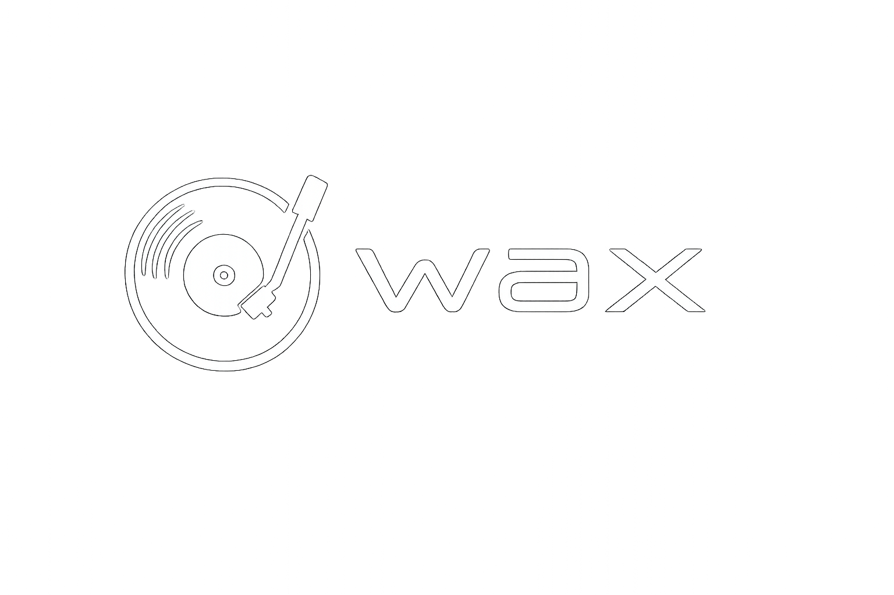

# Wax

> A modern, desktop YouTube → MP3 player. Stream by default, download for offline. Built as a packaged Electron app for macOS and Windows.



## What it does

- **Search YouTube directly** in-app — results render as regular track rows (heart, mix, spinner, hover-prefetch all unified with the rest of the app)
- **Stream by default** — every track plays via `yt-dlp` URL extraction with 5h URL cache, hover prefetch, and "look-ahead one" on queue progression so transitions feel instant
- **Discover** — landing screen surfaces a YouTube Mix inspired by a random favorite, or the YouTube "Today's Top Hits" playlist when the library is empty
- **Favoris vs Bibliothèque** — Favoris (heart-toggle) is the visible playlist; tracks added by saving a Mix or referenced by playlists live silently in the library so playlists keep working without polluting your favorites
- **Download for offline** — per-track button on every row converts a streamed favorite into a local MP3 320 kbps with circular progress ring
- **Playlists** — create, rename, delete, drag-reorder, bulk-add modal, "Tout télécharger" cascade
- **Mix inspired by this track** ("Spotify Radio" equivalent) — generates a 50-track stream queue from YouTube's `RD<videoId>` mix; "Sauvegarder" turns the temporary mix into a permanent playlist *without* downloading the songs (they stay streamable references)
- **Audio player** with shuffle / repeat / queue panel / crossfade / lyrics (via lyrics.ovh) / OS media controls (MediaSession API)
- **Adaptive accent palette** — extracts the dominant color from the current track's thumbnail; user can override with one of 8 presets
- **Audio-reactive equalizer** on the currently-playing track row (FFT split into bass / mid / high; sqrt curve for sensitivity)
- **Loading spinner** on track rows while the audio is buffering — no more "did my click work?" anxiety
- **Persisted state** — queue, position, shuffle/repeat, volume, accent prefs all restored on reload

## Stack

| Layer | Tech |
|---|---|
| Frontend | Vue 3 (Composition API, `<script setup>`) + Pinia + Vite |
| Backend | Express 4 (Node 18+) — REST + SSE for download progress |
| Desktop | Electron 33 + electron-builder (DMG / NSIS / AppImage) |
| Audio | HTMLAudioElement + Web Audio API (AnalyserNode) |
| Extraction | yt-dlp (subprocess) for stream URLs and downloads |
| Conversion | ffmpeg (called by yt-dlp) for MP3 320 kbps encoding |
| Fonts | Inter (body) + Bricolage Grotesque (display, hero h1) |

## Install & dev

Prerequisites: **Node 18+**, **yt-dlp**, **ffmpeg** on PATH.
```bash
brew install yt-dlp ffmpeg          # macOS
# or sudo apt install yt-dlp ffmpeg # Debian/Ubuntu (yt-dlp via pip if needed)
```

Then:
```bash
git clone https://github.com/dgadacha/wax.git
cd wax
npm install
npm run dev
```

`npm run dev` runs Vite (port 5173) + Express (port 3000) + Electron, with HMR.

## Build for distribution

```bash
npm run dist:mac     # → release/Wax-{version}.dmg (arm64 + x64)
npm run dist:win     # → release/Wax-Setup-{version}.exe (NSIS)
npm run dist:linux   # → release/Wax-{version}.AppImage
```

Required assets (drop into `build/`):
- `build/icon.icns` — macOS app icon (1024×1024 source recommended)
- `build/icon.ico` — Windows app icon
- `build/icon.png` — Linux fallback (512×512)

For signed/notarized builds (Mac App Store or trusted distribution outside it), set up `electron-builder.yml` with your team ID + Apple ID env vars. The current config produces unsigned artifacts — fine for local use, will trigger Gatekeeper warnings for end users.

The `extraResources` block in `electron-builder.yml` is wired to bundle yt-dlp + ffmpeg binaries from `build/bin/<os>/<arch>/` if you drop them there. Otherwise the app falls back to the system PATH at runtime (which only works if the user has them installed).

## Architecture (high-level)

```
┌──────────────────────────────────────────────────────────────┐
│                     Electron main process                    │
│  electron/main.cjs                                            │
│    ├─ forks server.js as child (PORT=3000)                   │
│    └─ creates BrowserWindow → loads localhost:5173 (dev)     │
│                                       or  dist/index.html     │
└──────────────────────────────────────────────────────────────┘
          ▲                                          ▲
          │ HTTP /api/*                              │ static
          │                                          │
┌─────────┴────────────────┐         ┌───────────────┴────────────┐
│   Express (server.js)    │         │    Vue 3 renderer (src/)   │
│                          │         │                            │
│  /api/library            │         │  components/  views/       │
│  /api/playlists          │         │  stores/      composables/ │
│  /api/search             │         │  lib/         styles/      │
│  /api/stream/:id         │         │                            │
│  /api/preview/:id        │         │  Pinia for shared state.   │
│  /api/mix/:id            │         │  CSS vars for theming.     │
│  /api/lyrics             │         │                            │
│  /api/jobs (SSE)         │         │                            │
└──────────────────────────┘         └────────────────────────────┘
          ▼
   yt-dlp / ffmpeg
   (subprocess)
```

For deeper detail, read [`CLAUDE.md`](./CLAUDE.md) — it's a complete map of the codebase intended to bootstrap any new dev (or Claude session) without prior context.

## Project layout

```
wax/
├── electron/
│   ├── main.cjs           # main process: server fork + BrowserWindow
│   └── preload.cjs        # exposes window.wax (versions, platform)
├── server.js              # Express backend (yt-dlp orchestration, JSON storage)
├── library/               # runtime data dir (audio/, previews/, *.json) — gitignored
├── public/                # static assets served at root (logo.png, textlogo.png)
├── src/
│   ├── main.js            # Vue entry
│   ├── App.vue            # root component — view switcher
│   ├── components/        # reusable UI (Sidebar, Player, TrackRow, Modal, ...)
│   ├── views/             # one per "page" (Search, Library, Playlist, Mix, Smart)
│   ├── stores/            # Pinia: library, playlists, player, search, mix, ...
│   ├── composables/       # useVisualizer, useLyrics, useDragReorder
│   ├── lib/               # api, modal bus, toast bus, format/icons helpers
│   └── styles/style.css   # single global stylesheet (~1700 lines)
├── index.html             # Vite entry HTML
├── vite.config.js         # /api proxy to localhost:3000
├── electron-builder.yml   # DMG / NSIS / AppImage configs
├── MIGRATION.md           # vanilla-JS → Vue migration mapping (historical)
├── CLAUDE.md              # codebase map for AI-assisted development
└── package.json
```

## Known limitations

- **yt-dlp dependency**: extraction can break overnight when YouTube tweaks their internals. `yt-dlp` updates fix this within hours; tell users to `yt-dlp -U` if they hit issues.
- **First stream takes ~3 s**: `yt-dlp -g` with the `android` player client (~2.5× faster than the default `web` client). Subsequent calls hit the 5-hour URL cache. Hover prefetch on track rows and player look-ahead (next-track-in-queue) hide most of this from the user.
- **Concurrent yt-dlp limit = 3**: imposed server-side to prevent CPU saturation. Prefetch storms beyond 3 are queued.
- **`@distube/ytdl-core` is NOT used** — we tried it (purely-JS, in-process), it's currently broken on the YouTube formats we need. Stays out until upstream catches up.
- **Mix uses `watch?v=…&list=RD…` form** — YouTube refused the `playlist?list=RD…` form mid-2026 with "This playlist type is unviewable", so the mix endpoint constructs the watch-page URL instead.
- **No code signing yet**: `.dmg` / `.exe` artifacts trigger Gatekeeper / SmartScreen warnings unless you configure signing in `electron-builder.yml`.
- **No icons committed**: `build/icon.icns` and `build/icon.ico` need to be added before `dist:*` will succeed.
- **Single-user, single-machine**: no cloud sync, accounts, or multi-device library.

## License

Personal project. All YouTube interactions are subject to YouTube's Terms of Service — Wax is intended for use with content the user owns or content under permissive licenses (Creative Commons, public domain, etc.). Distribution of copyrighted material is the user's responsibility.

---

Built with ❤ by Dylan with help from Claude.
